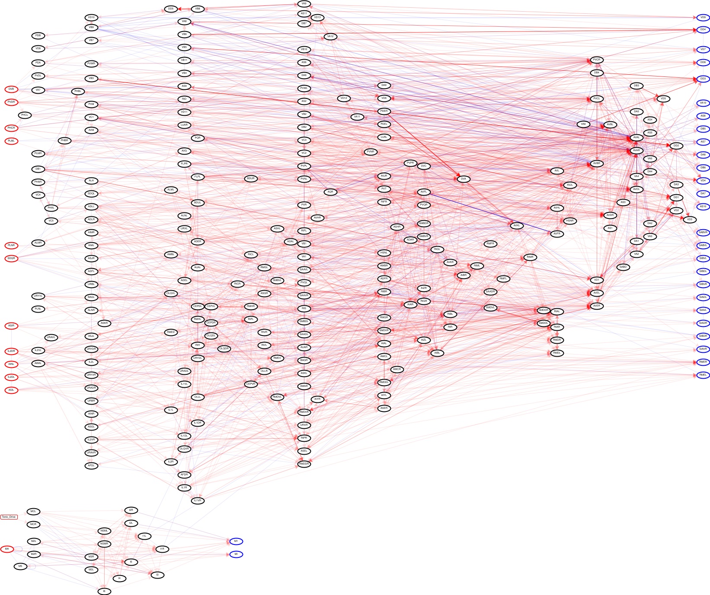
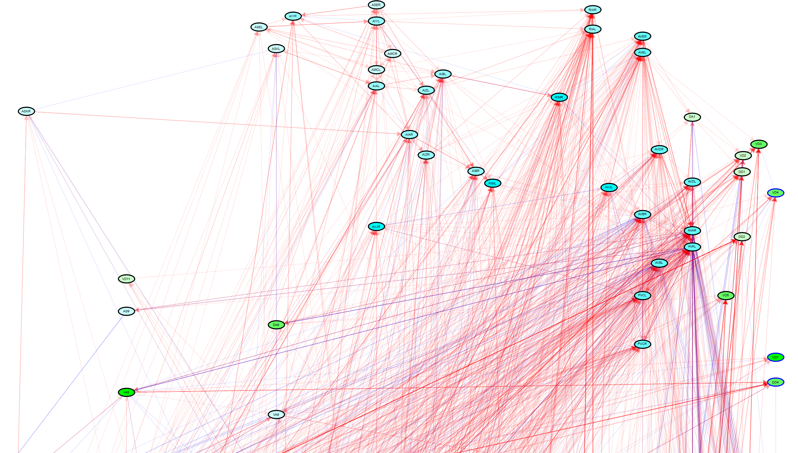

## Wormworld and the Amphid Response

Richard Feynman believed that a deeper understanding of something can lead to a deeper aesthetic appreciation of it. He famously said, in reference to the appreciation of a flower:

*… I can appreciate the beauty of a flower. At the same time, I see much more about the flower than \[my artist friend\] sees. I could imagine the cells in there, the complicated actions inside, which also have a beauty. I mean it’s not just beauty at this dimension, at one centimeter; there’s also beauty at smaller dimensions, the inner structure, also the processes. The fact that the colors in the flower evolved in order to attract insects to pollinate it is interesting; it means that insects can see the color. It adds a question: does this aesthetic sense also exist in the lower forms? Why is it aesthetic? All kinds of interesting questions which the science knowledge only adds to the excitement, the mystery and the awe of a flower. It only adds. I don’t understand how it subtracts.*

To that end, I wish to explain the underlying mechanisms of the Wormworld, and one of the compositions within it, “Amphid Response”. I think it is beautifully hypnotic music, but there are complicated actions inside, and an amazing set of processes at work.

## The Nematode

In 1986, John White and his collaborators published the complete connectome – a wiring diagram of a nervous system – for the nematode Caenorhabditis elegans (*C. elegans*). It was the first complete connectome ever mapped for any organism, having only 302 neurons and about 6,000 neural connections, all mapped out in excruciating detail. Over time, the exact function of each neuron was established. C. elegans is tiny, only about 1mm, and it has less than 1,000 cells in its whole body, so it is about one third nerve cells (neurons). Humans have trillions of cells, but less than 0.3% of them are neurons. So, who really has the bigger brain?

In nematodes, as in all animals, each neuron is like a tiny rechargeable battery, holding a very small electric charge from about \-70 mV to about \+40 mV. They connect to one another and push each other’s charge around, and that’s basically the whole game. Interestingly, this happens in several very different ways simultaneously:

* **Through chemical connections**: each neuron with a higher charge will push chemicals across a synaptic gap to other neurons, pushing their charge in the other up or down (usually up).  
* **Through electrical connections**: the voltages of any two electrically connected neurons average out over time, like two batteries connected to each other through a resistor.  
* **Through action potentials**: if the voltage rises above a threshold voltage of \-20 mV, the cell pulls in ions that spike the voltage up to the peak of 40 mV in about a millisecond. Then there is a refractory period of about 4 milliseconds where the voltage drops all the way down to \-70 mV before climbing back up to the \-50 mV resting voltage.  
* **Through leaks**: any charge above or below the resting voltage of \-50 mV tends to leak away through the cell walls over time.

This all seems pretty straightforward, since it is about a billionth the complexity of a human nervous system. But even at this miniscule scale, it is still pretty complicated. The full connectome looks like this:

In the diagram above:

* The red lines represent the chemical connections, which mostly point to the right, but sometimes point back to the left (this is where the “recurrent” part comes in).   
* The blue lines represent the electrical connections, which are more like wires and have no direction.   
* Bolder lines have higher “weights”, and sometimes these weights are negative (i.e., they inhibit rather than excite their neighbors).  
* The neurons on the left with red outlines have no chemical connections from other neurons – they only connect to sensors (like smell or touch).  
* The neurons on the right with blue outlines have no chemical connections to other neurons – they mostly connect to muscles. 

Notice that there’s a nearly isolated group of twenty neurons on the bottom left. This is the pharyngeal network that controls the organism’s gut. It is almost like the nematode has two brains: one for their gut and one for everything else\!

## The Simulation

We all know about artificial intelligence, which is modeled after these kinds of recurrent neural networks (RNN). And we know we can run AI on machines. What if you could run a brain like this on a machine? What would it do? What would it look like when it was reacting to stimuli? And, more importantly, what would that *sound* like? 

So that’s what I did. Clearly, I am not the first person to have simulated the worm’s nervous system in software, nor even the first to have attempted to voice the results. But I may be the first who tried to turn that into actual music. Moreover, I wanted to build something from scratch (using the Scala programming language), sourcing the connection and weight data directly from the NeuralML source data without relying on any simulation libraries or utilities. (And definitely avoiding Python\!) This is all my work, with ample guidance and support from Google Gemini (thanks Google), but far from “vibe coded”. I used AI mostly as a guide to learn about the biology of the nervous system, to discover the logic behind simulating a biological network like this, and much less to write the actual code.

Without going into too much more gory detail, I created a physics simulator that, using thousands of very small time steps (10 steps per simulated millisecond), evaluated the voltage change in each neuron based on its electrical and chemical connections it has to its neighbors, implemented neural spiking behavior, and allowed for current leakage. I also built the visualization component from scratch that automatically laid out the full network based on a general left-to-right flow that pulled connected neurons closer together, without overlapping (too much), and animated the voltage changes in each neuron during a simulation. If I stimulated one or more neurons, I could see how that stimulus would percolate and reverberate through the network. Visually, this is fascinating to watch.

## The Music

But visualizing it was not enough. This whole project started because I wanted an interesting source of sounds. I thought the nervous system of an organism would be a great source of chaos. I was only kind of right.

For this composition, I chose to stimulate the organism’s chemical sensors – basically its sense of smell. This involved artificially raising the voltage briefly on the amphid sensory neurons connecting into the nerve ring: ASIL and ASIR. (The nerve ring is essentially the organism's brain.)

The first musical choice was how to get some stereo separation. The L and R in the neuron names above are a hint. They indicate that these neurons are found on the left and right sides of the worm’s body. These neuron pairs tend to fire together (like your left and right nostril smelling something). In fact, being an organism with bilateral symmetry (like us), many neurons (about 60%) have this left/right pairing. That fact led to my first musical choice: to map left-side neurons to the left channel and right-side neurons to the right channel sharing the same musical note. If they fired exactly together, the sound would be center-balanced. If they fired slightly out of phase, there’d be a slight pan giving us some stereo separation.

It turned out that if I stimulated these amphid neurons for about 50 simulated milliseconds, I could evoke a cascade of neural activations all the way to the neurons controlling muscle activation for locomotion. I.e., I could make the virtual worm smell something and attempt to back up. The stimulation had to be gradual: starting from the resting state of \-50 mV, I pulled the voltage up gradually to a peak of \-25 mV by half-way through, then let it drift back down to resting by the end of the 50 milliseconds. The resulting cascade reverberated for about 600 simulated milliseconds after the stimulus stopped – a response to the event far outlasted the event itself.

The remaining musical choices involved what to actually voice and how to voice it.

* Not all of the 302 neurons participate strongly in this reaction. I decided to pluck out the 45 most active neurons – 15 left/right pairs plus 15 central – for voicing. (By “active” I mean the neurons with the largest voltage standard deviation over time, i.e., they were wiggly.) This was a convenient number since each MIDI sequence only supports 15 musical channels, so I could get away with one sequence for left, one for right, and one for center.  
* MIDI allowed me to map a voltage range of each neuron to a volume, and the range I chose were voltages from the resting state (-50 mV) up to the threshold voltage (-20 mV), the point at which a neuron “fires” an action potential spike. Spikes are cool, but the voltage changes leading up to the spikes is where all the musical action is\!  
* All the central neurons (in the ventral nerve cord) are related to locomotion, the ultimate downstream response to the stimuli. I placed these in high octaves on the grand piano. Since these neurons move more abruptly, having a more percussive instrument as the lead allowed all the chaotic activity to come through beautifully.   
* All the left/right pairs related to intercepting and interpreting the stimuli, and these moved in more swelling waves. I placed these in low octaves using a string ensemble as their voice. This would allow chords to rise in both pitch and intensity as the activation wave moved though the nerve ring.  
* For the actual notes I chose the C Minor Pentatonic scale (C, Eb, F, G, Bb), like the tuned rods of a wind chime. I thought if wind chimes can sound musical even in chaotic breezes, so could my neuron voices. This pentatonic scale lacks half-steps – no matter how many neurons fire simultaneously, it would never sound dissonant or muddy. (And it might accidentally play the funky clavinet riff on Stevie Wonder’s "Superstition" – thanks Wikipedia.)  
* For the timescale, I mapped each simulated millisecond (10 steps) to a quarter note and chose a 120 BPM tempo. This means the timescale is zoomed in 500 times, turning two simulated milliseconds into a full second of sound. This allows all the intricacies of the response to be heard without sounding overly chaotic, and turns the 660 simulated milliseconds of reverberating activity into a performance lasting five and a half minutes.   
* For live monitoring of my network, MIDI only allows a single set of 15 musical channels, but I have 45\. I used a channel-stealing algorithm to voice the loudest 15 neurons at any given time. This was sufficient for monitoring but lacked the depth of the full composition.  
* For integrating the final composition, I used GarageBand. My software generates a left, right, and center MIDI file on completion of the simulation. I loaded these into GarageBand for the final trimming and export. No other manual changes were made. It is all unedited worm\!

The following tables describe general neural groupings, and how each neuron is voiced.

### 1. The Sensory Vanguard

Input from the head. Octave 1 strings.

| Neuron(s) | C | Eb | F | G | Bb |
| --- | --- | --- | --- | --- | --- |
| AWCL / AWCR | 1 |  |  |  |  |
| ASEL / ASER |  | 1 |  |  |  |
| ASKL / ASKR |  |  | 1 |  |  |

### 2. The Integration Hub

Processors in the nerve ring. Octave 2 strings.

| Neuron(s) | C | Eb | F | G | Bb |
| --- | --- | --- | --- | --- | --- |
| AIAL / AIAR | 2 |  |  |  |  |
| AIBL / AIBR |  | 2 |  |  |  |
| AIZL / AIZR |  |  | 2 |  |  |
| RIAL / RIAR |  |  |  | 2 |  |
| AIYL / AIYR |  |  |  |  | 2 |

### 3. The Command Core

Grouped by direction. Octave 3 strings.

#### _Backward Drivers (in the nerve ring)_

| Neuron(s) | C | Eb | F | G | Bb |
| --- | --- | --- | --- | --- | --- |
| AVAL / AVAR | 3 |  |  |  |  |
| AVDL / AVDR |  | 3 |  |  |  |
| AVEL / AVER |  |  | 3 |  |  |

#### _Forward Drivers (AVB in the nerve ring, PVC in the tail)_

| Neuron(s) | C | Eb | F | G | Bb |
| --- | --- | --- | --- | --- | --- |
| AVBL / AVBR |  |  |  | 3 |  |
| PVCL / PVCR |  |  |  |  | 3 |

### 4. The Modulators

In the nerve ring. Octave 4 strings.

| Neuron(s) | C | Eb | F | G | Bb |
| --- | --- | --- | --- | --- | --- |
| RIML / RIMR | 4 |  |  |  |  |
| AVJL / AVJR |  | 4 |  |  |  |

### 5. The Locomotion Engine

In the ventral nerve cord, arranged anatomically from head to tail. Octaves 4-6 piano.

| Neuron(s) | C | Eb | F | G | Bb |
| --- | --- | --- | --- | --- | --- |
| DA1 | 4 |  |  |  |  |
| DD1 |  | 4 |  |  |  |
| VD1 |  |  | 4 |  |  |
| DD2 |  |  |  | 4 |  |
| VD2 |  |  |  |  | 4 |
| VD3 | 5 |  |  |  |  |
| DD4 |  | 5 |  |  |  |
| VD4 |  |  | 5 |  |  |
| VD5 |  |  |  | 5 |  |
| DA6 |  |  |  |  | 5 |
| VD6 | 6 |  |  |  |  |
| VD7 |  | 6 |  |  |  |
| VA8 |  |  | 6 |  |  |
| AS9 |  |  |  | 6 |  |
| VA9 |  |  |  |  | 6 |

Another way to visualize these voiced neurons is as the active subnetwork of the full network. In the below graphic, only the voiced neurons are shown with their connections to the broader network flowing off screen. Nodes highlighted in lighter to darker shades of blue represent the strings by increasing octaves. Nodes highlighted in lighter to darker shades of green represent the piano by increasing octaves. As I mentioned earlier, the network is highly recurrent. So not all locomotion neurons are on the right side of the page, since they are also the source for many other neurons. That’s how the reverberation is sustained.

## The Result

The resulting ambient, pseudo-rhythmic melodies are reminiscent of a Brian Eno or Phillip Glass composition. I’m not accusing those guys of being worms, but I think they would be jealous of what a little nematode can do.
* [Audio only (higher quality)](https://drive.google.com/file/d/1Bj0iIqx0x_S515AwHzBNjSL_vsO2BlPH/view?usp=drive_link)
* [Simulation video (with lower quality audio)](https://drive.google.com/file/d/14a_qOd0Hz6pOvUHfFB96E_DYuSsiNIje/view?usp=sharing)

Below is a listening guide – the chronological roadmap of this neuronal performance:

* **0:00 - The stimulus begins.** We drop a virtual chemical scent into the simulation. Initially there is just silence. (The initial thud is from all the neurons initializing at \-45 mV and quickly settling down to their \-50 mV resting state.)   
* **0:10 – The message is received.** The sensory bass begins to swell as the stimulus reaches its peak. The sensory neurons and associated nerve ring processors begin to react to the stimulus. This reaction continues to grow even as the stimulus fades.  
* **0:22 - The muscles start to twitch.** At this point the stimulus is all but gone, but the real physical reaction is just starting. The neurons responsible for locomotion begin to carry the message down the nerve cord. Some neurons are yelling “move forward” while about twice as many are yelling “back up” – it is a tug-of-war within the organism for which movement will dominate. These reverberating waves of instructions continue about every six seconds, recursively reactivating neurons deep in the nerve ring, keeping the string section engaged.  
* **5:00 – The resonance weakens.** Key neurons in the nerve ring are winding down as their energy leaks away and they can no longer pass the threshold for creating action potentials. The memory of the stimulus is fading.  
* **5:20 – The last locomotive signal is sent.** Without the energy of the nerve ring, the piano hits its final note.   
* **5:30 – Return to resting.** All the neurons have leaked away their extra energy and have returned to their resting state. The performance has ended. The worm takes a bow.
